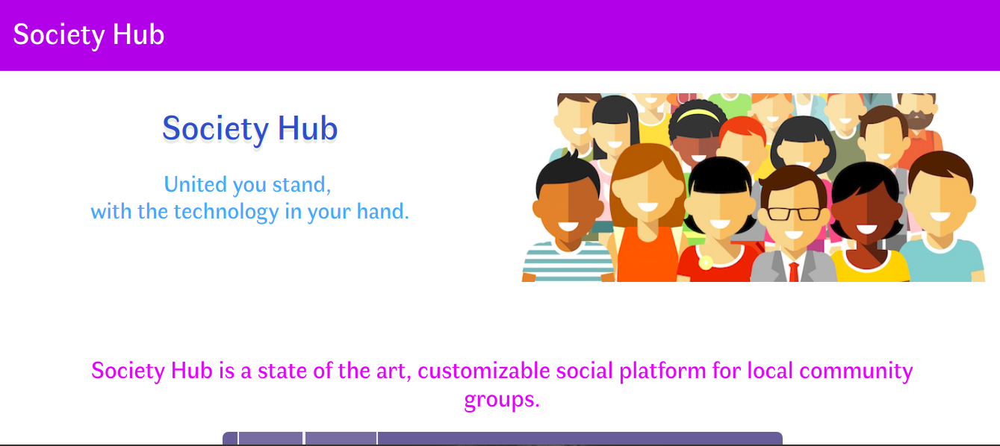
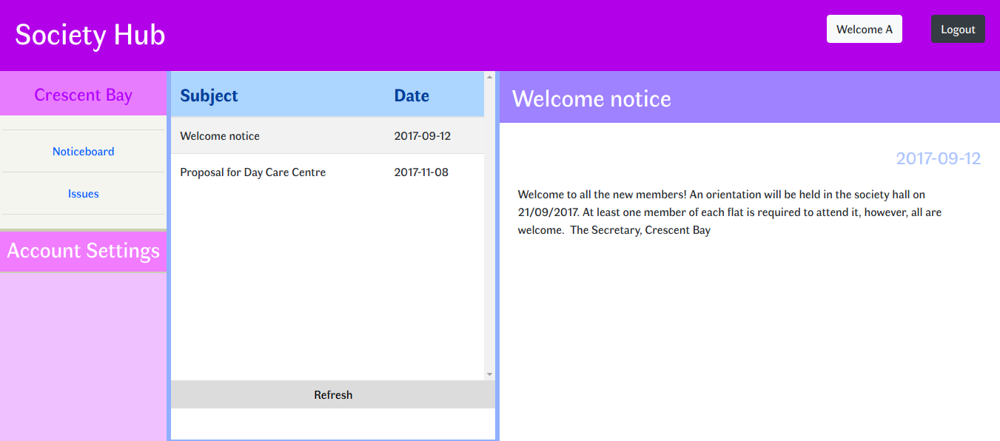
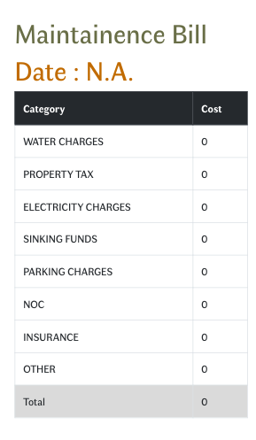

# Society Management
#### A simple web-application in flask for society-management and accounting system.

Login Page


Notice Board


Bill Page {mobile view}


## Configurations:

1. Activate the virtual environment
```
# TRAVEL TO THE PROJECT DIRECTORY IN YOUR TERMINAL
./venv/bin/activate
#OR
source venv/bin/activite
#OR
venv/bin/activate
```
2. Install all the dependencies to your virtual environment
```shell
 pip3 install -r dependencies.txt
```
3. Create database onto your local mysql-server 
  * Open mysql shell and fire the following queries

```sql
#IF DATBASE EXISTS, YOU MIGHT HAVE TO DETELE AND RE-CREATE IT
DELETE DATABASE society_mysqldb;
CREATE DATABASE society_mysqldb;
exit;
```
  * Run the following command in terminal to create your databse as per your .sql file
```shell
mysql -u root -p society_mysqldb < society_mysqldb.sql
```
4. To run the flask server
```shell
export FLASK_APP=start.py

# to run the flask-server on debug-mode
export FLASK_DEBUG=1

# to run the flask-server on production-mode
export FLASK_DEBUG=0

#if the above line doesn't work, use :
python3 -m flask run --host=0.0.0.0:5000

#OR
python3 -m flask run

#host is optional, and should not matter unless you want to test the application on a physical device on your network.
```
5. To save dependencies list in your requirements.txt file
```shell
pip3 freeze > requirements.txt 
```
